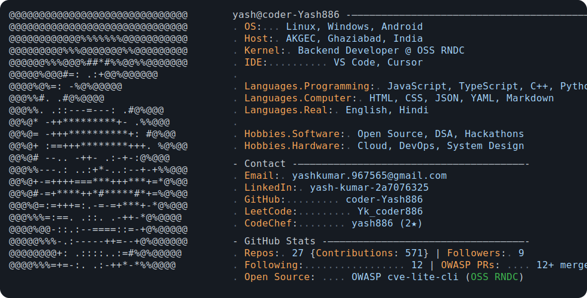

<!-- Neofetch-style profile card (Andrew6rant inspired) -->
<picture>
  <source media="(prefers-color-scheme: dark)" srcset="./dark_mode.svg">
  <source media="(prefers-color-scheme: light)" srcset="./light_mode.svg">
  
</picture>

  
  
  
  
  
  

---

# 🚀 About Me

I'm **Yash Kumar**, a **Full Stack Developer & Programmer** passionate about building modern, scalable web applications and contributing to open-source ecosystems.

I enjoy working on systems that involve:
- full-stack web development
- real-time & interactive applications
- RESTful APIs & backend services
- open-source collaboration
- competitive programming & DSA
- developer tooling & automation

# ⚙️ Tech Stack

 

---

# 💼 Professional Experience

## 🔹 Open Source Society (OSS RNDC) — [@ossrndc](https://github.com/ossrndc)

### Backend Developer
📍 Ghaziabad, Uttar Pradesh  
📅 Present

College technical society — [Open Source R&D Centre](https://github.com/ossrndc), the open-source team of AKGEC.

- Built and maintained scalable backend APIs using **Node.js** and **Express.js** for technical event registration systems
- Collaborated on open-source projects and delivered solutions used in college events with **200+ participants**
- Implemented **JWT authentication**, **MongoDB** integration, and REST API optimization for improved scalability and performance
- Managed development workflows using **Git**, **GitHub**, **Docker**, and **Postman** for version control and API testing

### Core Technologies

`Node.js` • `Express.js` • `MongoDB` • `JWT` • `Docker` • `Git` • `GitHub` • `Postman`

---

## 🔹 OWASP — [cve-lite-cli](https://github.com/OWASP/cve-lite-cli)

### Open Source Contributor
📅 2025 – Present  
🔗 [**View Merged PRs**](https://github.com/OWASP/cve-lite-cli/pulls?q=is%3Apr+author%3ACoder-Yash886+is%3Aclosed)

Contributed to [**OWASP cve-lite-cli**](https://github.com/OWASP/cve-lite-cli), an OWASP Lab Project — a CLI security tool for lightweight CVE lookup used by security researchers worldwide (633+ stars).

- Got **12+ pull requests merged**, improving tool functionality, code quality, and overall developer experience
- Added features including `--create-pr` flag, `--debug` logging, fix version publish dates, and yarn lockfile path reconstruction
- Collaborated with the global open-source security community under OWASP following standard code review workflows

### Core Technologies

`TypeScript` • `Node.js` • `Security` • `CLI` • `Open Source` • `OWASP`

---

# 🌐 Open Source Contributions

| Project | Organization | Link |
|---------|--------------|------|
| **cve-lite-cli** | [OWASP](https://owasp.org/) | [github.com/OWASP/cve-lite-cli](https://github.com/OWASP/cve-lite-cli) |
| **OSS RNDC** | AKGEC College Society | [github.com/ossrndc](https://github.com/ossrndc) |
| **Rocket.Chat** | Communications Platform | [github.com/RocketChat/Rocket.Chat](https://github.com/RocketChat/Rocket.Chat) |

---

# 📊 GitHub Stats

  

---

# 📈 Contribution Graph

<!-- graph-updated: 2026-07-13 | contributions: 556 -->

# 🏆 Achievements

### Competitive Programming

- 🏅 **CodeChef** — Achieved **2★ rating** with a current rating of **1458** and solved **270+** coding problems ([Profile](https://www.codechef.com/users/yash886))
- 💻 **LeetCode** — Solved **150+** DSA problems with active participation in weekly and biweekly coding contests ([Profile](https://leetcode.com/u/Yk_coder886/))
- ⚔️ **Codeforces** — Solved **100+** competitive programming problems and regularly participated in rated contests ([Profile](https://codeforces.com/profile/yash886))

### Hackathons & Open Source

- 🚀 Participated in **Hacknovate 7.0** International Hybrid Hackathon organized by ABES Institute of Technology, Ghaziabad, 2026
- 🔐 **OWASP Contributor** — **12+ merged PRs** to [cve-lite-cli](https://github.com/OWASP/cve-lite-cli), an OWASP Lab Project with 633+ stars
- 🌟 **Open Source Contributor** at [OSS RNDC](https://github.com/ossrndc) — College technical society at AKGEC
---
