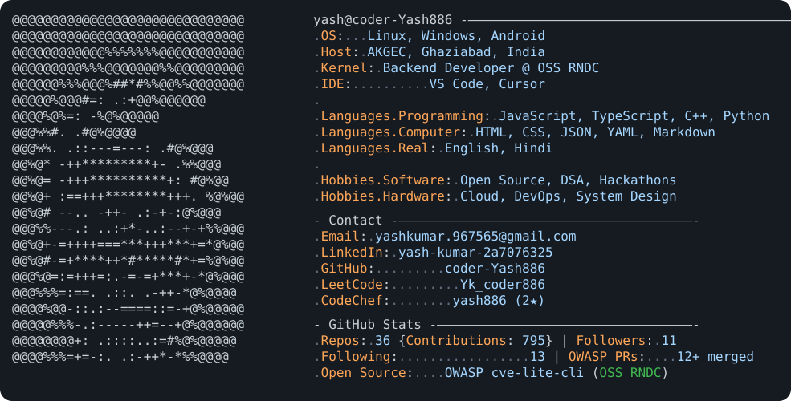

<!-- Neofetch-style profile card (Andrew6rant inspired) -->
<picture>
  <source media="(prefers-color-scheme: dark)" srcset="./dark_mode.svg">
  <source media="(prefers-color-scheme: light)" srcset="./light_mode.svg">
  
</picture>

  
  
  
  
  
  

