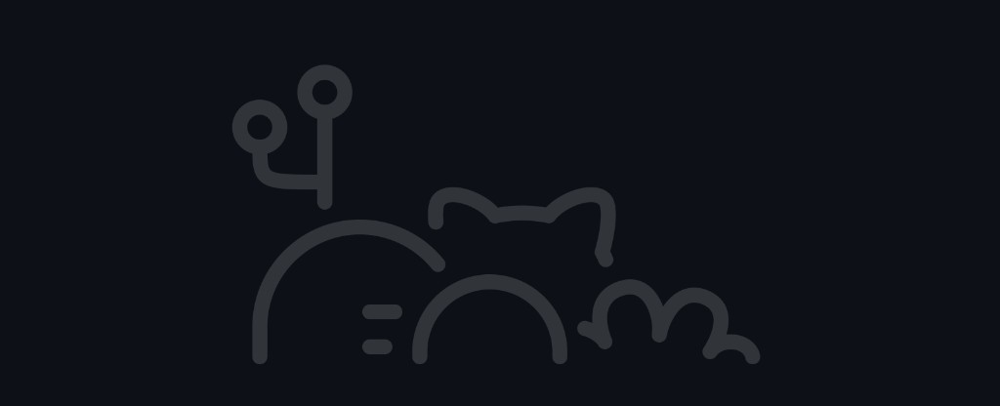

<!-- Banner -->

  

<!-- Animated Intro -->

<h1 align="center">
  
</h1>

Full Stack Developer • Backend & APIs • Open Source @ OWASP • DSA

  

---

# 🚀 About Me

I'm a **backend-focused software engineering student** building scalable APIs and AI-powered applications with **Node.js, TypeScript, PostgreSQL, and MongoDB** — and shipping that work into real open source.

Today I'm:

- 🔐 **Open Source Contributor at OWASP** — [cve-lite-cli](https://github.com/OWASP/cve-lite-cli), production-grade CVE security tooling
- 🤖 Building **AI-powered products** — video meetings, transcription, Gemini summaries, async workflows
- 💻 Grinding DSA — **280+ LeetCode** · **300+ CodeChef** · **2★ (1458)**

My focus is simple: ship reliable backends, contribute real open source, and keep systems fast, testable, and production-ready.

---

# 🧠 What I Work On

### Backend & Systems
- REST APIs, JWT auth, and protected-route architectures
- Peak-traffic backends and event registration systems
- Real-time infrastructure (WebSockets, live video sessions)
- Docker-based deployments, Vercel / Render, CI/CD concepts

### Open Source & Security Tooling
- CLI diagnostics: structured JSONL logs, OSV request/response traces
- Automated remediations: OSV-validated fixes opened as GitHub PRs
- Dependency resolution fixtures (Yarn lockfiles, transitive fixes)
- npm registry lookups for fix-version publish dates and release-age policy

---

# ⚙️ Tech Stack

### Languages & AI

`Node.js` • `TypeScript` • `Google Gemini API` • `Inngest` • `REST APIs` • `JWT` • `WebSockets` • `tRPC` • `DSA` • `OOP` • `DBMS` • `OS` • `CN`

### Engineering

---

# 💼 Experience

## 🔹 OWASP — **Open Source Contributor**

### [cve-lite-cli](https://github.com/OWASP/cve-lite-cli) — Lightweight CVE Lookup CLI

📅 May 2026 – Present · Remote  
🔗 [Merged PRs](https://github.com/OWASP/cve-lite-cli/pulls?q=is%3Apr+author%3ACoder-Yash886+is%3Aclosed)

OWASP Lab Project used by security researchers for lightweight CVE lookup. I ship production-grade CLI features — diagnostics, automated remediations, fixtures, and report accuracy.

**What I shipped**

- 🐞 **`--debug` flag** — structured JSONL diagnostic logs with batch-correlated OSV request/response traces, cache events, and fix-validation data, with **zero overhead** when disabled ([#471](https://github.com/OWASP/cve-lite-cli/pull/471))
- 🔀 **`--create-pr` flag** — apply OSV-validated fixes and automatically open GitHub PRs via `gh`, with scoped dependency staging and branch-collision handling ([#518](https://github.com/OWASP/cve-lite-cli/pull/518))
- 🧶 **Yarn lockfile fixture** — validate transitive dependency resolution for within-range fixes; coordinated with maintainers on a companion Yarn-parser fix ([#537](https://github.com/OWASP/cve-lite-cli/pull/537))
- 📦 **npm registry lookups** — surface fix-version **publish dates** in terminal and HTML reports so teams can enforce minimum release-age security policies ([#700](https://github.com/OWASP/cve-lite-cli/pull/700))

**Core Technologies**

`TypeScript` • `Node.js` • `CLI` • `OSV` • `GitHub CLI` • `Security Tooling`

---

# 🚀 Featured Projects

## 🔹 Nexora AI — AI-Powered Video Meeting Platform

🌐 **Live:** https://nexora-ai-1qwb.vercel.app · 💻 [GitHub](https://github.com/coder-Yash886/Nexora-AI)

Full-stack AI video meeting platform with secure authentication, real-time meetings, automatic transcription, and AI-generated summaries.

- Stream Video SDK + Google Gemini for meetings, transcript chat, and summaries
- Asynchronous workflows with Inngest
- Production deploy on Vercel

`Next.js` • `Node.js` • `Stream Video SDK` • `Google Gemini API` • `Inngest` • `Vercel`

---

## 🔹 Brain-Dock — Second Brain Content Management

🌐 **Live:** https://brain-dock-eosin.vercel.app · 💻 [GitHub](https://github.com/coder-Yash886/Brain-dock)

Full-stack platform to organize and securely share tweets, videos, links, and documents.

- JWT authentication, protected routes, MongoDB Atlas
- Frontend on Vercel, backend on Render

`Node.js` • `Express.js` • `MongoDB Atlas` • `JWT` • `Vercel` • `Render`

---

## 🔹 OSS AKGEC — Technical Community Platform

🌐 **Live:** https://oss.akgec.ac.in · 💻 [GitHub](https://github.com/coder-Yash886/oss-site)

Official technical community platform for AKGEC — events, registration, and contributor workflows.

- Event registration engineered for **500+ registrations** at peak traffic
- REST APIs for event management and registration

`React.js` • `TypeScript` • `Node.js` • `Express.js` • `MongoDB` • `Vercel`

---

# 🏆 Achievements

- 🥇 **CodeChef 2★** — rating **1458**, **300+** problems solved
- 🥇 **CodeChef Starters 236 (Rated)** — global rank **659** among **30,000+** candidates
- 🥇 **CodeChef Starters 237 (Rated)** — global rank **837** among **25,000+** candidates
- 💻 **LeetCode** — **280+** DSA problems, weekly & biweekly contests
- 🔐 **OWASP contributor** — debug logging, auto-PR remediations, Yarn fixtures, and registry publish-date reports on [cve-lite-cli](https://github.com/OWASP/cve-lite-cli)

---

# 📊 GitHub Analytics

<!-- stats refresh daily via .github/workflows/update-stats.yml -->

  

  
  

  

  
  

  

  

---

# 🎯 Currently Going Deeper On

- Production backend design — scale, reliability, and clean API contracts
- Security-focused open source (CVE tooling, dependency fix automation)
- AI-powered product features (summarization, agents, async workflows)
- System design + DSA for interviews
- Docker, cloud deploys, and CI/CD discipline

---

# 🤝 Connect With Me

  
  
  
  

---

⭐ If you like my work, consider starring my repositories.

⚡ Building backends that ship — one PR at a time.

